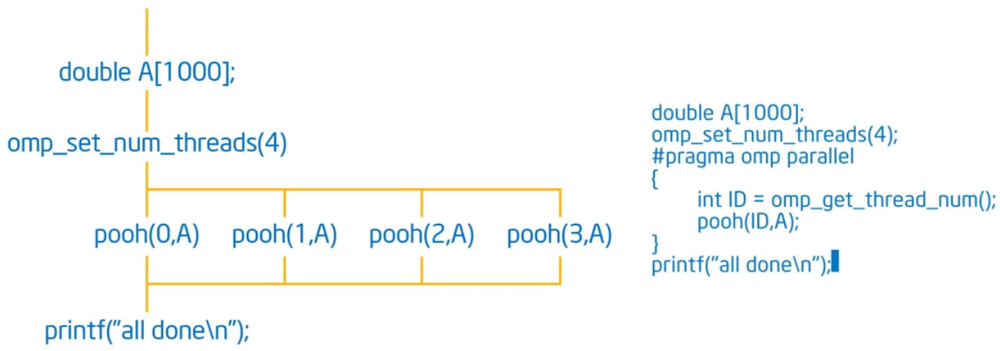
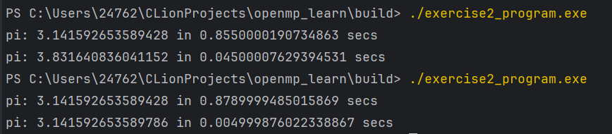
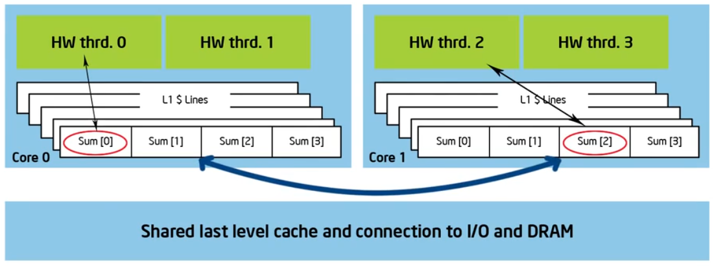
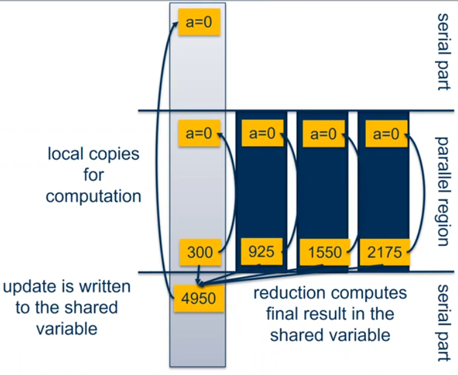
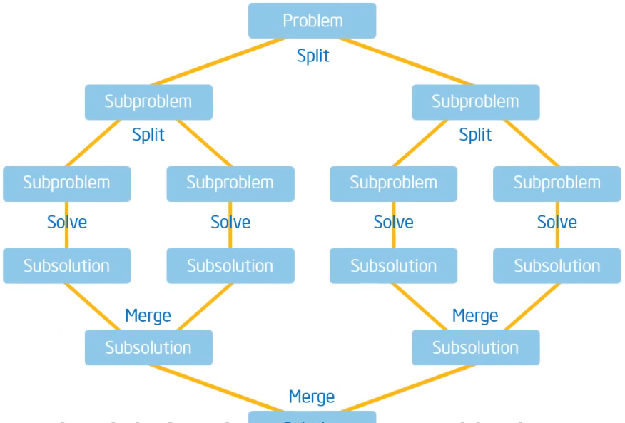

### OpenMP概览

- **OpenMP** 是一种多线程共享地址模型，用于并行编程。
- 线程之间通过共享变量进行通信，允许多个线程同时访问相同的内存空间。
- 意外共享数据会导致**竞争状况**，这种状况通常发生在多个线程试图同时修改同一数据时。
- **竞争条件**：当程序的结果随着线程调度的不同而变化时，就出现了竞争条件。
- 要控制竞争条件，应该使用同步机制（如 `#pragma omp critical` 或 `#pragma omp atomic`）来保护共享数据，以防止数据冲突。
- 同步操作通常会带来性能开销，因此需要谨慎使用。
- OpenMP提供了许多同步工具，如 **互斥锁**（`omp_lock_t`）和**屏障**（`#pragma omp barrier`），来确保线程安全。
- 使用 `#pragma omp parallel` 指令来创建并行区域，其中包含的代码会被多个线程执行。


```c++
#include <stdio.h>
#include <omp.h>

void pooh(int id, double *A) {
    // 这里可以添加对数组A的操作，比如一些计算
    printf("Thread %d is processing.\n", id);
}

int main() {
    double A[1000];
    omp_set_num_threads(4);  // 设置线程数为4

    #pragma omp parallel
    {
        int ID = omp_get_thread_num();  // 获取当前线程的ID
        pooh(ID, A);  // 调用函数，传递线程ID和数组A
    }

    printf("all done\n");
    return 0;
}
```
- 并行区域：
程序进入并行区域后，OpenMP会创建4个线程，并行执行pooh(ID, A)函数。
每个线程都有自己唯一的ID，同时共享数组A的指针
- 同步： 所有线程完成其任务后，程序将退出并行区域，并由主线程
打印"all done"

### 静态条件尽量避免
```c++
void calc_pi_serial() // 串行版本
{
    long num_steps = 0x20000000;

    double step = 1.0 / (double)num_steps;
    double sum = 0.0;
    double start = omp_get_wtime( );
    for (long i = 0; i < num_steps; i++) {
        double x = (i + 0.5) * step;
        sum += 4.0 / (1.0 + x * x);
    }
    double pi = sum * step;

    printf("pi: %.16g in %.16g secs\n", pi, omp_get_wtime() - start);
    // will print "pi: 3.141592653589428 in 5.664520263002487 secs"
}
```
```c++
void calc_pi() //并行版本
{
    omp_set_num_threads(0x20);
    long num_steps = 0x1000000;
    double step = 1.0 / (double)num_steps;
    double start = omp_get_wtime();
    double pi = 0.0;
    // double sum = 0.0; // 如果sum在这里，非常容易出现竞争条件
    // sum是一个共享变量，多个线程高频率地写入，会导致竞争条件，导致结果不确定
    #pragma omp parallel
    {
        double sum = 0.0;
        int ID = omp_get_thread_num();
        for(int i = ID+1; i <=num_steps; i+=0x20)
            sum += 4.0 / (1.0 + ((i - 0.5) * step) * ((i - 0.5) * step));
        pi += sum * step;
    };
    printf("pi: %.16g in %.16g secs\n", pi, omp_get_wtime() - start);
}
```

上面的结果就是将sum放到外面的情况，不仅慢，结果也错误

### 伪共享
```c++
#define NUM_THREADS 2

void calc_pi_omp_v1()
{
    long num_steps = 0x20000000;
    double sum[NUM_THREADS] = { 0.0 };
    double step = 1.0 / (double)num_steps;
    int nthreads;
    double start = omp_get_wtime( );    
    
    omp_set_num_threads(NUM_THREADS);
    #pragma omp parallel
    {
        int id = omp_get_thread_num();
        int nthrds = omp_get_num_threads();
        if (id == 0) { // master thread
            nthreads = nthrds;
        }
        for (long i = id; i < num_steps; i += nthrds) {
            double x = (i + 0.5) * step;
            sum[id] += 4.0 / (1.0 + x * x);
        }  
    }
    double pi = 0;
    for (int i = 0; i < nthreads; i++) {
        pi += sum[i]*step;
    }
    
    printf("pi: %.16g in %.16g secs\n", pi, omp_get_wtime() - start);
}
```
当NUM_THREADS足够大时候，这个程序的性能会很差，这就是伪共享的问题

伪共享（False Sharing）是并行编程中的一个性能问题，
特别是在多线程应用中。当多个线程在不同的CPU核心上运行并尝试访问 
和修改不同的共享变量时，伪共享可能发生。这些变量彼此独立，但由于它们、位
于同一个缓存行中，修改其中一个变量可能导致其他变量的缓存无效，
从而引发性能下降。

1. 多核架构：
    - 图中的硬件线程（HW Thread）0和1在Core 0上运行，而线程2和3在Core 1上运行
    - 每个核心都有它自己的L1缓存，L1缓存非常快，但容量有限
2. 缓存行：
    - 每个核心的L1缓存由若干缓存行（Cache Lines）组成，缓存行是缓存中最小的存储单位。一个缓存行通常是64字节
    - 图中的Sum[0], Sum[1], Sum[2], Sum[3]是不同线程在操作的变量
3. 伪共享：
    - 在图中，线程0和线程2分别在Core 0和Core 1上运行，它们操作的是位于同一个缓存行中的不同变量（如Sum[0]和Sum[2]）
    - 当线程0更新Sum[0]时，由于Sum[0]和Sum[2]位于同一个缓存行内，缓存一致性协议会使Core 1的缓存行无效（即使Sum[2]本身没有被线程0修改）
    - 接下来，线程2需要重新从共享的最后一级缓存（LLC）或主存中加载这个缓存行，从而导致性能的降低

#### 缓存行的逻辑共享与缓存一致性协议
逻辑上的共享意味着，虽然每个核心都有自己的L1和L2缓存，但这些缓存是通过共享的L3缓存和主存来保持数据一致性的。当一个核心对某个缓存行中的数据进行修改时，缓存一致性协议（如MESI协议）会确保其他核心能够同步地获取到更新后的数据

#### 共享缓存行的现实
尽管每个核心有自己独立的L1和L2缓存，但它们通常会共享L3缓存，甚至在某些体
系结构中，共享的L3缓存会和主存紧密耦合。L3缓存通常是多核处理器中的“最后一级缓存”，所有核心都可以访问。

当数据在L1缓存中被修改时，缓存一致性协议会在整个缓存层次中传播，从L1到L2，
再到L3，甚至主存，确保所有核心看到的是一致的数据。因此，虽然在物理上L1缓存是独立的，但从逻辑上看，所有核心通过缓存一致性协议共享数据。

伪共享是一种容易忽视但会严重影响多线程程序性能的问题。理解伪共享的成因并采取适当的措施（如数据对齐和
内存填充）可以有效提升并行程序的性能，避免连续的元素存在不同的cashe line中很重要

```c++
typedef struct {
        double value;
        char padding[CACHE_LINE_SIZE - sizeof(double)];
    } PaddedDouble;

    PaddedDouble sum[NUM_THREADS] = {{0.0}};
```
缓存行填充：通过定义PaddedDouble结构体并在每个double类型的value后面加上足够的填充字节，使得sum[id]元素之间的距离超过一个缓存行的大小（通常是64字节），
从而避免不同线程访问的sum[id]落在同一缓存行中


### 同步
#### 高层同步
高层同步主要用于控制线程之间的交互和数据访问，以防止数据竞争和确保程序的正确性。

1. critical (互斥)
   - 作用: 互斥（Mutual Exclusion）保证某段代码在任意时刻只有一个线程能够执行。
   其他线程必须等待，直到当前线程完成这段代码的执行
   - 使用场景: 当多个线程可能同时访问和修改共享数据时，为了避免竞争条件，
   你可以使用 critical 保护这段代码
   ```c++
   #pragma omp critical
   {
    // 这里的代码在同一时刻只能有一个线程执行
   }
    ```
2. atomic (原子操作)
   - 作用: atomic用于执行某些简单的操作（如加法、减法等）时，保证这些操作是原子的，
   即不会被其他线程的操作中断
   - 使用场景: 当你只需要对一个变量进行简单的原子操作时，使用atomic会比critical效率更高，
   因为atomic直接利用了硬件的原子操作支持
    ```c++
   #pragma omp atomic
   sum += value;
    ```
3. barrier (屏障)
   - 作用: barrier是一种同步点，所有线程在这个点会等待，
   直到所有线程都到达该点后才继续执行
   - 使用场景: 当你需要确保所有线程在继续执行之前完成某个特定阶段的工作时，
   可以使用barrier
    ```c++
   #pragma omp barrier
    ```
4. ordered (有序)
   - 作用: 用于确保在指定代码段中的操作按线程的顺序执行，而不是并行执行
   - 使用场景: 当你有一些需要按顺序执行的代码，即使在并行区域内，也可以使用ordered来保证执行顺序
    ```c++
   #pragma omp for ordered
   for (int i = 0; i < n; i++) {
        #pragma omp ordered
        {
            // 这里的代码会按照线程的顺序依次执行
        }
   }
    ```
#### 低层同步
底层同步机制更贴近硬件和内存操作，主要用于控制线程的内存访问顺序和锁定机制
1. flush (刷新)
   - 作用: 用于确保线程在某一时刻将它们的私有缓存或寄存器中的数据刷新到共享内存，或确保从共享内存中获取最新的数据
   - 使用场景: 当你希望确保某个变量的最新值已经被写回主内存或者确保接下来读取到的值是其他线程更新后的值时
    ```c++
   #pragma omp flush
    ```
2. lock (锁)
   - 作用: 提供了一种显式的锁定机制，允许线程在执行某些代码之前先获取锁，并在执行完毕后释放锁。
   这样可以精确控制哪些线程可以访问某个共享资源
   - 使用场景: 当你需要更细粒度的锁定控制（例如嵌套锁）或者想避免使用critical这样的高层次抽象时，
   可以使用locks
    ```c++
   omp_lock_t lock;
   omp_init_lock(&lock);

   omp_set_lock(&lock);
   // 只有获取到锁的线程才能执行这段代码
   omp_unset_lock(&lock);

   omp_destroy_lock(&lock);
   ```

### Schedule子句
在并行编程中，理想情况下，我们希望所有线程能够均匀地分担工作量，
以避免某些线程过度忙碌，而另一些线程却处于空闲状态。这种现象被称为负载不均衡。
负载不均衡会导致处理器资源的浪费，降低并行程序的效率。
schedule子句通过指定循环迭代的分配策略， 帮助我们避免或减轻负载不均衡的问题

#### 各种 schedule 策略
1. schedule(static [, chunk])
   - 静态调度意味着在并行区域开始之前，所有循环迭代的分配就已经决定了。在这种方式下，每个线程获得的迭代数量是固定的，调度过程完全由编译器或运行时系统根据chunk大小进行划分。
   这种调度方式没有运行时的调度开销，因为迭代的分配是预先计算好的
   - 适合工作量均匀的循环：如果每个迭代的工作量相近，静态调度可以很好地平衡线程的工作负载
   ```c++
    #pragma omp parallel for schedule(static, 4)
   // chunk=4意味着每个线程每次处理4次迭代，线程将以循环的方式处理这些迭代
   ```
2. schedule(dynamic [, chunk])
   - 动态调度是一种运行时的调度策略，它根据线程的执行情况动态地分配任务。线程在完成当前分配的任务块后，会继续从剩余的任务中请求下一个任务块，直到所有任务完成。
   这种调度方式适合处理工作量不均匀的循环，因为它能有效地平衡线程负载
   - 负载平衡：通过动态分配任务块，每个线程在完成前一块任务后，立即接收下一块任务，
   从而最大限度地利用所有线程的计算能力，避免负载不均衡
   - 适应性强：动态调度可以很好地应对工作量不可预测的循环
   - 调度开销：由于任务块是动态分配的，每次分配任务都会产生一定的调度开销，
   特别是在chunk较小的情况下，调度开销可能会显著影响性能
    ```c++
     #pragma omp parallel for schedule(dynamic, 4)
    // chunk=4仍然是每个线程每次处理4次迭代，但与静态调度不同，线程不一定按照固定的顺序获取块。
    // 线程完成当前块后，会动态地获取下一个块
    ```
3. schedule(guided [, chunk])
   - 指导性调度是一种结合了静态和动态调度优点的策略。它开始时分配较大的任务块，随着循环的推进，任务块的大小逐渐减小，直到达到指定的最小块大小。
   这种策略在初期通过大块分配减少调度开销，而在后期通过小块分配平衡负载
   - 减少调度开销：在初期分配大块任务可以减少调度的频率，从而减少调度开销
   - 适用场景有限：指导性调度在工作负载从重到轻逐渐减少的场景中表现最佳。如果工作负载的分布不符合这种模式，可能会出现调度不当的情况
    ```c++
     #pragma omp parallel for schedule(guided, 2)
    // 初始块较大，然后逐渐减小到chunk=2的大小。这样可以在程序初期快速分配大块任务，减少调度开销，后期通过小块任务来平衡负载
    ```
4. schedule(runtime)
   - 运行时调度允许程序在执行期间根据环境变量或其他设置动态选择调度策略。这样做的好处是，
   程序可以在不修改代码的情况下，通过调整运行时环境来优化性能
   - 灵活性高：程序员可以根据实际的运行环境和需求，在运行时选择最优的调度策略，而无需重新编译代码
   - 便于调试和优化：在不同的硬件或输入规模下， 程序可以通过调整OMP_SCHEDULE环境变量快速测试不同的调度策略
   - 不可预测性：由于调度策略是在运行时决定的，可能难以在开发和调试阶段预测程序的行为
    ```c++
     #pragma omp parallel for schedule(runtime)
    ```
   ```c++
   // 运行程序时，可以通过设置 OMP_SCHEDULE 环境变量来指定调度策略和块大小
   export OMP_SCHEDULE="dynamic,4"
   ./your_program
   // 此时的调度策略是由运行时环境变量决定的，而不是在代码中硬编码
   // 可以在不同的运行环境下调整OMP_SCHEDULE，以找到最优的调度策略
   ```
5. schedule(auto)
   - 自动调度将调度的选择交给编译器或运行时系统。编译器或运行时会根据循环的特性、硬件架构和系统负载等因素，
   选择一个最优的调度策略。这种策略降低了开发者的调度选择负担
   - 降低复杂性：开发者不需要花费时间和精力去分析哪种调度策略最适合当前的循环，编译器或运行时会自动做出选择
   - 不透明性：开发者无法明确知道使用了哪种调度策略，可能会给调试和性能优化带来一定困难
    ```c++
     #pragma omp parallel for schedule(auto)
    ```

### reduction 原语
#### reduction的原理
在并行编程中，多个线程可能会同时执行某些计算任务，并生成一些局部结果。
这些局部结果通常需要汇总为一个全局结果，例如在求和、乘积、最值等操作中。
如果直接对全局变量进行操作，会导致数据竞争（Race Condition）， 导致结果不正确。reduction 机制正是为了解决这个问题

- reduction 的基本工作流程
1. 局部副本的创建
   - 在并行区域开始时，每个线程为参与 reduction 的变量创建一个局部副本。
   这些局部副本是独立的，因此不同线程的计算不会相互干扰
   - 这些局部副本的初始值由 reduction 操作符决定。例如，对于加法操作，初始值是 0；对于乘法操作，初始值是 1
2. 并行计算
   - 每个线程在并行区域内使用自己的局部副本进行计算。
   所有计算都是在各自的局部副本上完成的，不会影响其他线程的计算
3. 归约操作
   - 在并行区域结束时，OpenMP 将每个线程的局部副本的值合并到一个共享的全局变量中。这个合并过程由 reduction 操作符决定。
   例如，对于加法操作，所有线程的局部副本的值会被加到一起

- 支持的 reduction 操作符:加法 (+)：求和；乘法 (*)：求积；最大值 (max)：求最大值；最小值 (min)：求最小值；逻辑与 (&&)：逻辑与；逻辑或 (||)：逻辑或；按位与 (&)：按位与；按位或 (|)：按位或；按位异或 (^)：按位异或



```c++
#include <omp.h>
#include <stdio.h>

// 乘法规约
int main() {
    int n = 10;
    int product = 1;

    #pragma omp parallel for reduction(*:product)
    for (int i = 1; i <= n; i++) {
        product *= i;
    }

    printf("Product of first %d natural numbers is: %d\n", n, product);
    return 0;
}
```
```c++
#include <omp.h>
#include <stdio.h>
#include <limits.h>

// 最小值规约
int main() {
    int arr[] = {3, 7, 2, 9, 1, 8, 4};
    int n = sizeof(arr) / sizeof(arr[0]);
    int min_val = INT_MAX;

    #pragma omp parallel for reduction(min:min_val)
    for (int i = 0; i < n; i++) {
        if (arr[i] < min_val) {
            min_val = arr[i];
        }
    }

    printf("Minimum value in array is: %d\n", min_val);
    return 0;
}
```

### 锁
#### 一般锁
1. omp_init_lock()
   - 初始化一个锁对象，在使用锁之前必须调用此函数进行初始化
    ```c++
   omp_lock_t my_lock; // omp_lock_t 是一个锁类型
   omp_init_lock(&my_lock);// omp_init_lock() 初始化该锁，使其进入未锁定状态，准备供线程使用
   ```
2. omp_set_lock()
   - 设置（锁定）一个锁，如果锁已经被其他线程持有，调用线程将被阻塞，直到锁可用
   ```c++
   omp_set_lock(&my_lock);
   ```
3. omp_unset_lock()
   - 释放（解锁）一个锁，允许其他被阻塞的线程获取该锁
    ```c++
    omp_unset_lock(&my_lock);
    ```
4. omp_destroy_lock()
   - 在程序结束或不再需要锁时，调用 omp_destroy_lock() 释放锁对象的资源。
   销毁后的锁不能再使用，除非重新初始化
    ```c++
    omp_destroy_lock(&my_lock);
    ```
5. omp_test_lock()
   -  类似于 omp_set_lock()，但它是非阻塞的。如果锁已被其他线程持有，
   线程可以选择执行其他操作，而不是等待锁可用
    ```c++
    if (omp_test_lock(&my_lock)) {
        // 锁已被其他线程持有，执行其他操作
    } else {
        // 锁可用，执行需要锁保护的操作
        omp_unset_lock(&my_lock);
    }
    ```
#### 嵌套锁
嵌套锁与简单锁类似，但它允许同一线程多次获取同一个锁，而不会引起死锁。
每次锁定必须有对应的解锁操作，只有当所有锁定都被释放后，锁才真正被解锁

嵌套锁适用于更复杂的情况，比如在递归算法或嵌套的并行区域中，可能需要多次锁定和解锁同一个资源

- omp_init_nest_lock()：初始化一个嵌套锁对象
- omp_set_nest_lock()：设置（锁定）一个嵌套锁。如果锁已经被其他线程持有，调用线程将被阻塞，
直到锁可用。调用线程可以多次锁定同一个锁，每次锁定计数递增
- omp_unset_nest_lock()：释放（解锁）一个嵌套锁。
每次解锁后，锁定计数递减，当计数降为0时，锁才真正被释放
- omp_destroy_nest_lock()：销毁一个嵌套锁，释放资源
- omp_test_nest_lock()：测试并尝试锁定一个嵌套锁。
如果锁已经被其他线程持有，调用线程不会被阻塞，并返回锁定的计数值

```c++
#include <omp.h>
#include <stdio.h>

// 共享资源
int shared_data = 0;

// 嵌套锁
omp_nest_lock_t nest_lock;

// 递归函数
void recursive_function(int depth) {
    if (depth == 0) return;

    // 尝试锁定嵌套锁
    omp_set_nest_lock(&nest_lock);
    printf("Thread %d at depth %d locked. shared_data = %d\n", omp_get_thread_num(), depth, shared_data);

    // 修改共享数据
    shared_data += depth;

    // 递归调用
    recursive_function(depth - 1);

    // 递归结束，解锁嵌套锁
    omp_unset_nest_lock(&nest_lock);
    printf("Thread %d at depth %d unlocked. shared_data = %d\n", omp_get_thread_num(), depth, shared_data);
}

int main() {
    // 初始化嵌套锁
    omp_init_nest_lock(&nest_lock);

    #pragma omp parallel num_threads(2)
    {
        // 在并行区域中调用递归函数
        recursive_function(3);
    }

    // 销毁嵌套锁
    omp_destroy_nest_lock(&nest_lock);

    return 0;
}
```
如果用一般锁的话，上述情况会导致死锁

### 运行时库函数（Runtime Library Functions）
OpenMP 提供的一些常用的运行时库函数（Runtime Library Functions），
这些函数允许程序在运行时控制并行性，查询线程的状态和数量，以及配置动态线程等

1. omp_set_num_threads()
   - 设置用于执行并行区域的线程数量
   - 该函数只能在并行区域外部调用，否则行为未定义
   - 在执行并行区域之前，使用这个函数指定要使用的线程数。例如，如果你想让并行区域只使用4个线程
    ```c++
    omp_set_num_threads(4);
   #pragma omp parallel
   {
      // 并行执行的代码
   }
    ```
2. omp_get_num_threads()
   - 返回当前并行区域中的线程数量
   - 在并行区域内部调用此函数，以获得当前正在执行的线程数
   - 如果在并行区域外调用此函数，它将返回1，因为在串行执行时，只有一个线程在执行
    ```c++
   #pragma omp parallel
    {
        int num_threads = omp_get_num_threads();
        printf("Number of threads: %d\n", num_threads);
    }
   ```
3. omp_get_thread_num()
   - 返回当前线程的唯一标识符（ID）
   - 在并行区域内使用此函数来获取每个线程的唯一编号（从 0 开始），通常用于让不同线程执行不同的任务
    ```c++
    #pragma omp parallel
     {
          int thread_id = omp_get_thread_num();
          printf("Thread ID: %d\n", thread_id);
     }
     ```
4. omp_get_max_threads()
   - 返回在下一个并行区域中可能使用的最大线程数量
   - 如果想知道当前程序允许的最大线程数，可以调用此函数。例如，这在调试或配置线程数时非常有用
    ```c++
    int max_threads = omp_get_max_threads();
    printf("Max threads: %d\n", max_threads);
    ```
5. omp_in_parallel()
   - 判断当前是否在并行区域中执行
   - 如果当前线程在并行区域内执行，则返回非零值（通常为 1）,否则返回 0
    ```c++
    if (omp_in_parallel()) {
        printf("In parallel region\n");
    } else {
        printf("Not in parallel region\n");
    }
    ```
6. omp_set_dynamic()
   - 启用或禁用动态调整线程数量的功能
   - 启用动态线程调整时，OpenMP 运行时可以根据系统负载自动调整线程数。
   例如，如果系统负载很高，OpenMP 可能会减少并行区域中的线程数，以减少对系统资源的占用
    ```c++
    omp_set_dynamic(1); // 启用动态线程调整
    ```
7. omp_get_dynamic()
   - 查询是否启用了动态调整线程数量的功能
    - 如果动态线程调整功能已启用，则返回非零值（通常为 1），否则返回 0
     ```c++
     int dynamic = omp_get_dynamic();
     printf("Dynamic threads: %d\n", dynamic);
     ```
8. omp_get_num_procs()
   - 返回系统上可用的处理器数量
     ```c++
     int num_procs = omp_get_num_procs();
     printf("Number of processors: %d\n", num_procs);
     ```

### 环境变量
OpenMP 提供了一系列环境变量，这些变量可以用于在程序运行时配置和调整并行计算的行为。环境变量通过设置系统环境的方式对 OpenMP 运行时产生影响，
不需要修改代码就可以改变程序的并行行为。这种方式提供了非常灵活的并行计算控制手段

1. OMP_NUM_THREADS
   - 设置并行区域中使用的线程数量
   - 这个变量指定 OpenMP 在并行区域中使用的线程数量，覆盖程序中 omp_set_num_threads() 的设置
    ```c++
    export OMP_NUM_THREADS=4
   // 这样，所有并行区域将使用4个线程
    ```
2. OMP_STACKSIZE
   - 设置每个线程的栈大小
   - 当线程在并行区域中执行时，它们需要栈空间来存储局部变量。
   如果并行区域中使用了大量的局部变量或大数组，可能需要增加线程的栈空间以避免栈溢出
   - 默认的栈大小可能不足以处理非常大的局部数据结构，特别是在深度递归的程序中
   ```c++
        export OMP_STACKSIZE=16M
   ```
3. OMP_WAIT_POLICY
   - 控制等待线程的行为
     - ACTIVE：线程在等待工作时保持活跃状态，频繁检查是否有新的任务。
     这通常会消耗更多的 CPU 资源，但可以缩短线程被唤醒的延迟
     - PASSIVE：线程在等待工作时进入休眠状态，减少 CPU 资源的使用，但线程唤醒的延迟可能会增加
   ```c++
    export OMP_WAIT_POLICY=ACTIVE
   ```
4. OMP_PROC_BIND
   - 控制线程是否绑定到特定的处理器核
      - TRUE：线程绑定到特定的 CPU 核，确保线程在整个生命周期中在同一个核上运行
      - FALSE：线程可以在不同的 CPU 核之间迁移
   - 绑定线程有助于减少 CPU 核之间的线程迁移，从而减少缓存失效（cache miss），
   提高程序的性能，尤其是对缓存敏感的计算密集型任务
   - 不绑定线程允许操作系统灵活地调度线程，可以更好地平衡系统负载，适用于负载变化较大的场景
    ```c++
    export OMP_PROC_BIND=TRUE
    ```
5. OMP_DYNAMIC：控制是否启用动态调整线程数
6. OMP_NESTED：控制是否允许嵌套的并行区域
7. OMP_SCHEDULE：控制循环的调度策略
   - export OMP_SCHEDULE="dynamic,4" 设置为动态调度，每个线程处理4个迭代


### 数据作用域
由于OpenMP是基于共享内存的编程模型，所以大部分变量的属性默认是shared，比如static变量、
文件作用域的变量。但是并不是一切都是shared，并行域里调用的函数的栈变量是private，
语句块里的自动变量是private。基本原则是：Heap is shared, stack is private

#### shared 和 private
- shared：shared 变量在所有线程之间共享，所有线程都可以访问和修改同一个存储位置
- private 变量对于每个线程来说都是私有的，即每个线程都有自己的一份副本，线程之间互不干扰；当一个变量被声明为 private 时，
OpenMP 会为每个线程创建一个该变量的独立副本，线程之间的修改不会互相影响
```c++
double A[10];
int main() {
    int index[10];
    #pragma omp parallel
      work(index);
    printf("%d\n", index[0]);    
}

extern double A[10];
void work(int* index) {
    double temp[10];
    static int count;
    ...
}
/*
  A, index, count 是shared
  temp是private
  在函数 work 中，temp 是在并行区域内定义的局部变量，
  因此它在每个线程中都有一个私有副本，不会引发数据竞争
*/
```
#### private、firstprivate 和 lastprivate
- private：在并行区域内声明一个变量为 private，每个线程会有自己的独立副本，这个变量在并行区域外是不可见的
```c++
#pragma omp parallel for private(tmp)
for (int i = 0; i < 1000; i++) {
    tmp += i;  // 每个线程都有自己的 tmp
}
printf("%d\n", tmp);  // 无法访问 tmp，因为它是私有的
```
- firstprivate 是 private 的一种扩展，它在每个线程的私有副本中初始化时使用并行区域外的初始值
```c++
int incr = 0;
#pragma omp parallel for firstprivate(incr)
for (int i = 0; i < MAX; i++) {
    if ((i % 2) == 0) incr++;
    A[i] = incr;
}
// incr 在每个线程中都会被初始化为 0，并且在并行区域内每个线程有自己的独立副本
```
- lastprivate 也是 private 的扩展，它保证并行区域结束后，循环的最后一次迭代值会被保存在外部作用域的相应变量中
```c++
double x;
#pragma omp parallel for lastprivate(x)
for (int i = 0; i < N; i++) {
    x = a[i] * a[i] + b[i] * b[i];
    b[i] = sqrt(x);
}
printf("Last value of x: %f\n", x);
```
#### shared、private 和 firstprivate 的默认行为
- 在并行区域中，所有非局部变量默认是 shared，局部变量（包括栈变量）默认是 private
- 静态变量和全局变量默认是 shared
- 在工作共享构造（如 for 循环）中，循环变量默认是 private，其他变量则遵循并行区域中的规则

#### 全局/静态变量的私有化：threadprivate
- 如果需要将全局变量或静态变量私有化，可以使用 threadprivate 指令。
这使得每个线程都有自己的全局/静态变量副本，而不是共享同一个全局/静态变量
```c++
static int i;
#pragma omp threadprivate(i)
```

## Task
### #pragma omp task
task的组成
- 执行代码（Code to execute）：任务包含需要并行执行的代码段
- 数据环境（Data Environment）：定义任务中使用的变量和数据
- 内部控制变量（Internal Control Variables, ICV）：OpenMP 使用 ICV 来管理并行任务的执行和调度

#pragma omp task 用于创建一个并行任务，这个任务可以被一个线程独立执行，
任务的执行时间和顺序由 OpenMP 的运行时系统决定，这使得任务并行化非常灵活。
```c++
#pragma omp parallel
{
    #pragma omp task // 每个线程创建一个任务来执行 foo()
    {
        foo();
    }
    #pragma omp barrier // 等待所有线程完成 foo() 后再继续
    #pragma omp single // 只有一个线程创建任务执行 bar()
    {
        #pragma omp task
        {
            bar();
        }
    }
}
```
### taskwait
- #pragma omp taskwait 指令用来等待当前任务的直接子任务完成。当前任务会在所有直接子任务完成后继续执行
- 当一个任务依赖于它创建的其他任务的结果时，可以使用 taskwait 来确保在继续后续操作之前，所有相关的任务都已完成
```c++
#pragma omp parallel
{
    #pragma omp single
    {
        #pragma omp task // 任务 A
        {
            // 执行一些操作
        }

        #pragma omp task // 任务 B
        {
            // 执行一些操作
        }

        #pragma omp taskwait // 等待任务 A 和 B 完成

        #pragma omp task // 任务 C，依赖于任务 A 和 B 的结果
        {
            // 执行一些操作
        }
    }
}
```
### if
- if 子句用于控制是否创建任务。它可以帮助优化任务的创建和执行，特别是在任务的粒度较小时，避免过多的任务创建带来的开销
- 如果 if 子句的条件为 false，任务将不会被创建，而是在父任务中顺序执行
```c++
#pragma omp task if(n > 30)
{
    // 仅当 n > 30 时才会创建这个任务
    complex_computation();
}
```
### 任务的开销
- 任务创建开销：包括将任务数据结构填充到任务队列中；每次创建任务时，运行时系统需要为任务分配内存，并将其放入队列中等待执行。
- 任务执行开销：包括从任务队列中检索任务（可能涉及到工作窃取）并开始执行任务；特别是在任务粒度非常小的情况下，这些开销会变得明显
- 对于 OpenMP 任务：每个任务应该至少执行 80,000 到 100,000 条指令，才能有效利用并行性并减少开销
- 对于 TBB（Threading Building Blocks）任务：每个任务至少执行 30,000 到 50,000 条指令

### 任务和线程比较
- 线程：线程的复合性（composability）不如任务。线程不太适合复杂的、动态变化的任务组合（Composable Tasks）。
例如，如果你在一个已经使用多线程的应用程序中加载一个多线程的插件，可能会导致线程的过度使用
- 任务：是一个抽象的并行工作单元。任务可以比线程更细粒度，并且可以更灵活地调度
  - 任务模型天然具有良好的复合性（composability）。任务的创建和执行通常由运行时系统管理，
  开发者不必直接控制线程调度。任务可以根据系统的负载动态调度到线程上执行，避免了过度使用的问题
  - 任务池（Task Pool）：在任务模型中，所有创建的任务被放入一个任务池中，
  系统中的线程从任务池中提取任务并执行。这种方式确保了负载的动态平衡，可以有效利用系统资源
  - 任务模型特别适用于复杂、动态和不规则的并行计算，例如递归、图遍历或其他算法。在这些场景中，
  任务可以以不规则的方式创建和执行，而线程模型在处理这些复杂场景时可能会显得笨拙

### 任务的作用域
- 自动存储（即局部变量）在任务中是私有的，每个任务有自己的副本
- 静态和全局变量在任务中是共享的，所有任务共享同一块内存
- 在任务中，除非在封闭的上下文中被共享，否则变量默认是 firstprivate 的。
也就是说，每个任务会继承变量的初始值，而不是共享该变量
- 如果任务是孤立的（即它的创建不依赖于当前任务的任何变量），那么传递给任务的引用参数默认是 firstprivate 的，
这意味着每个任务有自己的变量副本，而不是共享变量

```c++
int a = 1;

void foo() {
    int b = 2, c = 3;
    #pragma omp parallel private(b)
    {
        int d = 4;
        #pragma omp task
        {
            int e = 5;
            // 变量作用域：
            // a 是 shared，值为 1
            // b 在 parallel 指令中被指定为 private,在任务中为 2 或者未定义
            // c 是 shared，值为 3
            // d 是 firstprivate，值为 4
            // e 是 private，值为 5
        }
    }
}
```
- 孤立任务变量：在创建孤立任务时，如果参数通过引用传递，这些参数默认是 firstprivate 的
  - 每个任务都会有自己的独立变量副本，而不是共享引用的对象
  - 这种行为避免了由于共享引用引发的数据竞争问题
```c++
void task_body(int &x) {
    x = x + 1;
}

void gen_task(int &x) {
    #pragma omp task
    task_body(x);  // x 是 firstprivate 的
}

void test(int &y, int z) {
    z++; 
    gen_task(y);   // y 是 firstprivate 的
    gen_task(z);   // z 是 private 的，每个任务有独立的 z 副本
}
```
   - 简单记忆，就是传引用进去，task里面的值依然是private的

### 内存一致性模型（Memory Consistency Model）
#### 顺序一致性（Sequential Consistency）
顺序一致性是一种内存一致性模型，通常被认为是最直观的并行执行模型。
它的特点是所有操作按照一个全局的顺序执行，且所有处理器都以相同的顺序看到操作结果：
- 要求
   - 对每个核心：操作必须保持代码中定义的顺序
   - 对其他处理器：操作的总顺序必须一致，即所有处理器看到的操作顺序是相同的

例如，假设两个处理器分别对一个共享变量 a 执行操作：
- Processor 1: a = 1
- Processor 2: print(a)

在顺序一致性模型中，无论何时执行 print(a)，Processor 2 必须看到 a 的值为 1，如果 Processor 1 已经执行了写操作

#### 弱一致性（Weak Consistency）
与顺序一致性不同，弱一致性允许处理器在某些情况下重新排序操作以提高性能，
但仍然保证关键的同步点（如 flush）能够确保一致性

OpenMP定义的内存一致性模型是一种弱一致性模型。在同一个线程内，不能将同步操作（S）与读写操作（R/W）重新排序
- 弱一致性模型确保了以下顺序的保证
  - S >> W (同步操作必须在写操作之前)
  - S >> R (同步操作必须在读操作之前)
  - R >> S (读操作必须在同步操作之前)
  - W >> S (写操作必须在同步操作之前)
  - S >> S (同步操作之间的顺序必须保持)

#### flush 操作
flush 是 OpenMP 中的一个关键操作，它用于确保线程在特定的同步点上看到一致的内存视图。
它定义了一个同步点，在这个点上，线程的所有读写操作都必须完成。

- flush 操作确保在其前后，特定变量或所有线程可见变量的所有读写操作都得到正确的排序和完成
- 如果使用 flush(list) 形式，只会对 list 中的变量进行刷新；如果不带参数，则刷新所有可见变量

```c++
int a = 0;

#pragma omp parallel num_threads(2)
{
    int id = omp_get_thread_num();

    if (id == 0) {
        a = 1;
        #pragma omp flush(a)
    } else {
        int b;
        #pragma omp flush(a)
        b = a;
        printf("Thread %d sees a = %d\n", id, b);
    }
}
```
在这个例子中，线程 0 将 a 设置为 1 并刷新它，
然后线程 1 读取 a 的值。flush 确保了线程 1 读取到的是线程 0 写入的最新值

#### Pairwise同步
Pairwise 同步 是一种在 OpenMP 中用于在两个线程或任务之间同步数据的方法。
OpenMP 并没有直接为两个线程之间的同步提供专门的构造，因此需要开发者手动实现这种同步机制。

Pairwise 同步的核心思想
- 使用共享标志变量（flag）：通过共享变量（flag）来控制生产者（producer）线程和消费者（consumer）线程之间的同步
- 自旋等待（spin-waiting）：消费者线程不断检查标志变量的值，直到它检测到生产者已经完成了数据的生产并更新了标志变量
- 使用 flush 操作：通过 flush 操作强制刷新缓存，以确保所有线程在 flush 之后看到一致的内存视图

```c++
int main() {
    double* A, sum, runtime;
    int flag = 0;
    A = (double*)malloc(N * sizeof(double));

    #pragma omp parallel sections
    {
        #pragma omp section
        {
            fill_rand(N, A);   // producer: fill an array of data
            #pragma omp flush
            flag = 1;
            #pragma omp flush(flag)
        }

        #pragma omp section
        {
            #pragma omp flush(flag)
            while (flag == 0) {
                #pragma omp flush(flag)
            }
            #pragma omp flush
            sum = sum_array(N, A);  // consumer: sum the array
        }
    }

    return 0;
}
```
尽管使用了 flush 来刷新内存视图，但由于 flag 的更新操作本身并不是原子操作， 可能导致极低概率的竞态条件。
这个竞态条件可能会在多线程情况下导致消费者线程错误地读取到 flag 的旧值， 从而读取未更新的数据

#### atomic 消除竞态条件
为了避免上述竞态条件，OpenMP 提供了 atomic 指令，确保对共享变量的更新是一个原子操作。
原子操作可以保证即使在多线程环境下，某个变量的更新操作也不会被其他线程打断，从而避免数据竞争

```c++
int main() {
    double* A, sum, runtime;
    int flag = 0;
    A = (double*)malloc(N * sizeof(double));

    #pragma omp parallel sections
    {
        #pragma omp section
        {
            fill_rand(N, A);   // producer: fill an array of data
            #pragma omp flush
            #pragma omp atomic write
            flag = 1;
            #pragma omp flush(flag)
        }

        #pragma omp section
        {
            while(1) {
                int flag_tmp;
                #pragma omp flush(flag)
                #pragma omp atomic read
                flag_tmp = flag;
                if (flag_tmp == 1) break;
            }
            #pragma omp flush
            sum = sum_array(N, A);  // consumer: sum the array
        }
    }

    return 0;
}
```
- 生产者使用 #pragma omp atomic write 确保 flag = 1 的操作是原子操作
- 消费者在读取 flag 时使用 #pragma omp atomic read，确保读取操作不会受到其他线程写入的干扰

### OpenMP线程的生命周期
OpenMP 的线程在一个并行区域结束后，并不会被立即销毁，而是被回收并继续在后续的并行区域中使用。
这是 OpenMP 的一种优化机制，称为线程池（Thread Pooling）

在 OpenMP 中，当程序进入一个并行区域时，会创建一组线程来执行任务。然而，创建和销毁线程是一个开销较大的操作。
为了提高效率，OpenMP 通常会使用线程池技术来管理线程的生命周期。

**线程池机制**
- 创建线程：当程序第一次进入并行区域时，OpenMP 运行时会创建一组线程，
通常与可用的 CPU 核心数相等。这些线程会存储在一个线程池中
- 复用线程：在后续的并行区域，OpenMP 运行时不会重新创建线程，
而是从线程池中取出已有的线程来执行新的并行任务。这样做可以显著减少线程创建和销毁的开销
- 线程保持活动：在线程池中，线程会保持活动状态，等待新的任务分配。因此，当第一个并行区域结束后，
这些线程并不会立即终止，而是被放回线程池，待下一个并行区域再次利用
- 线程销毁：只有在程序结束或者显式地调用 omp_set_num_threads(0) 等操作时，OpenMP 运行时才会销毁这些线程并释放资源


### 线程私有变量（threadprivate）
threadprivate 是 OpenMP 中的一种数据属性，它允许每个线程都有自己的私有变量副本，
而这些副本在不同并行区域之间可以保持持久性。 这意味着，即使并行区域结束，
每个线程的私有副本也会保留其值，直到程序结束

```c++
int counter = 0;
#pragma omp threadprivate(counter)  // 每个线程都有一个 counter 变量，并且初始化为 0

int increment_counter() {
    counter++;
    return counter;
}
```
适用于需要跨多个并行区域保持状态的线程局部数据，例如累加器或计数器等

```c++
#include <omp.h>
#include <stdio.h>

// 定义一个全局变量，用于累加每个线程的计算结果
int thread_accumulator = 0;

// 使用 threadprivate 使得每个线程都有自己的 accumulator 副本
#pragma omp threadprivate(thread_accumulator)

void phase1() {
    // 每个线程在第一阶段累加一些值
    #pragma omp parallel
    {
        thread_accumulator += omp_get_thread_num() + 1;  // 假设每个线程累加它的线程号加1
        printf("Phase 1: Thread %d, Accumulator = %d\n", omp_get_thread_num(), thread_accumulator);
    }
}

void phase2() {
    // 第二阶段继续累加，使用之前阶段的累加器结果
    #pragma omp parallel
    {
        thread_accumulator *= 2;  // 假设每个线程把累加器的值翻倍
        printf("Phase 2: Thread %d, Accumulator = %d\n", omp_get_thread_num(), thread_accumulator);
    }
}

int main() {
    phase1();  // 第一个并行区域
    phase2();  // 第二个并行区域

    // 汇总所有线程的累加器结果
    int final_result = 0;
    #pragma omp parallel reduction(+:final_result)
    {
        final_result += thread_accumulator;
    }

    printf("Final Result: %d\n", final_result);
    return 0;
}
```


### 常见的并行计算模式
#### 单程序多数据（SPMD）
SPMD（Single Program Multiple Data）是一种并行计算模式，其中相同的程序在多个处理单元上运行，
但每个处理单元使用不同的数据集。SPMD 模式常用于需要对大数据集进行并行处理的场景

```c++
#include "omp.h"

void main()
{
    int i, step;
    double pi = 0.0, sum = 0.0;
    step = 1.0 / (double)num_steps;
    
    #pragma omp parallel firstprivate(sum) private(x, i)
    {
        int id = omp_get_threads_num();
        int numprocs = omp_get_num_threads();
        int step1 = id * num_steps / numprocs;
        int stepN = (id+1) * num_steps / numprocs;
        if (id == numprocs - 1) {
            stepN = num_steps;
        }
        for (ri = step1; i < stepN; i++) {
            x = (i+0.5)*step;
            sum += 4.0/(1.0+x*x);
        }
        #pragma omp critical
        	pi += sum*step;
    }
}
```
核心思想：SPMD 模式下，所有线程运行同样的代码，但每个线程操作不同的数据分片。
通过线程的 id（线程编号）和总线程数 numprocs，可以计算出每个线程应该处理的数据范围

#### 循环并行（Loop Parallelism）
循环并行是指将循环的迭代分配给多个处理单元并行执行的模式。
这种模式非常常见，因为很多计算密集型任务都可以表达为对大数据集的循环处理

#### 分治模式（Divide and Conquer Pattern）


- 当问题存在分解成子问题的方法和将子问题的解重新组合为全局解的方法时使用。
- 定义一个分解操作。
- 持续分解直到子问题小到可以直接求解。
- 将子问题的解组合起来解决原始的全局问题。

```c++
#include "omp.h"

static long num_steps = 100000000;
#define MIN_BLK 10000000
double pi_comp(int Nstart, int Nfinish, double step)
{
    int i, iblk;
    double x, sum = 0.0, sum1, sum2;
    if(Nfinish - Nstart < MIN_BLK) {
        for(i = Nstart; i < Nfinish; i++) {
            x = (i+0.5)*step;
            sum += 4.0/(1.0+x*x);            
        }
    } else {
        iblk = Nfinish - Nstart;
        #pragma omp task shared(sum1)
          sum1 = pi_comp(Nstart, Nfinish - iblk/2, step);
        #pragma omp task shared(sum2)
          sum2 = pi_comp(Nfinish - iblk/2, Nfinish, step);
        #pragma omp taskwait
        sum = sum1 + sum2;
    }
    return sum;
}


int main()
{
    int i;
    double step, pi, sum;
    step = 1.0 / (double)num_steps;
    #pragma omp parallel
    {
        #pragma omp single
		sum = pi_comp(0, num_steps, step);
    }
    pi = step * sum;
	return 0;       
}
```